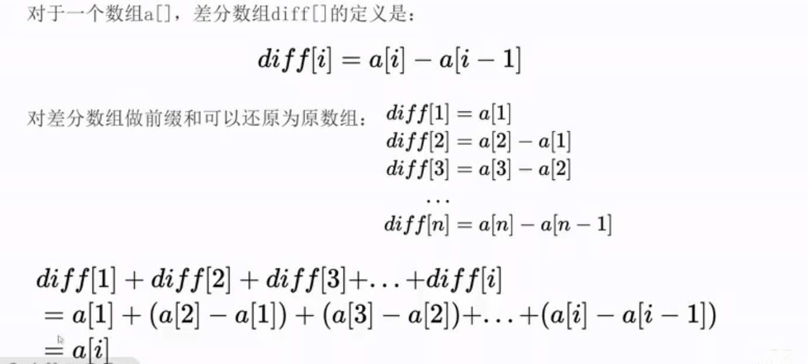
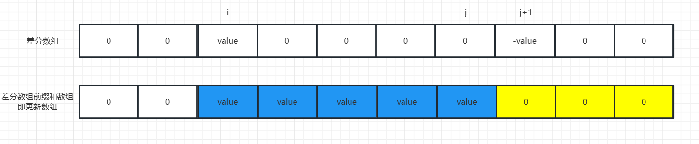
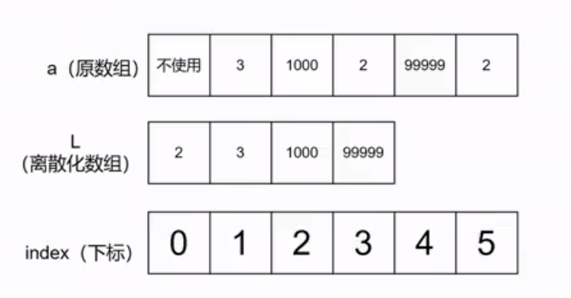
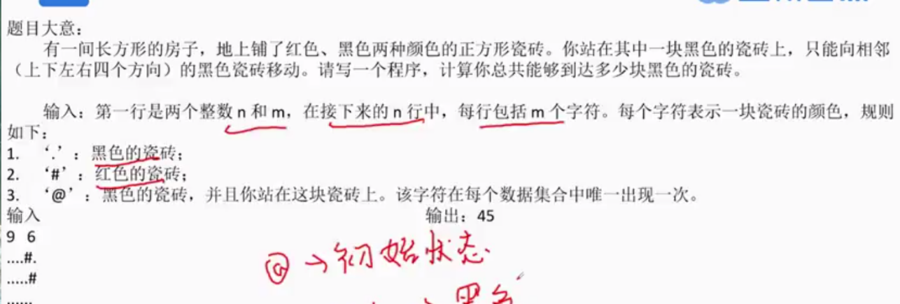
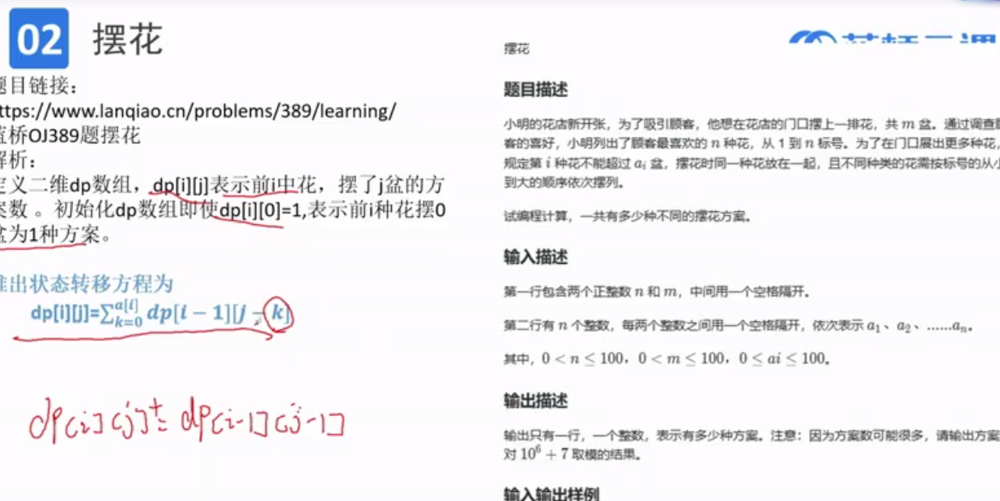
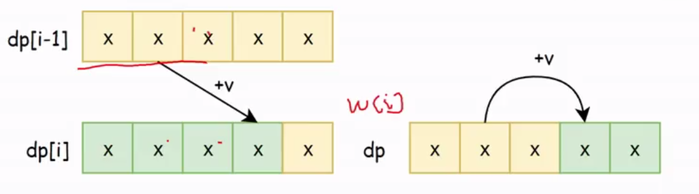

# 蓝桥杯语言基础总结

# 蓝桥杯java组String 在竞赛中常见的使用方法

toLowerCase()方法可以将字符串中的所有字符全部转换成小写,而非字母的字符不受影响。语法格式如下:

```
字符串名.toLowerCase()//将字符串中的字母全部转换为小写，非字母不受影响
```

toUpperCase()方法可以将字符串中的所有字符全部转换成大写，而非字母的字符不受影响。语法格式如下:

```
字符串名.toUpperCase()//将字符串中的字母全部转换为大写，非字母不受影响
```

刚才string类中的两种方法，可以将字符串中的大写字母转换成小写字母，或者将小写字母转换成大写字母。如果我们要将一个字符串中的大写字母转换成小写字母，小写字母转换成大写字母，我们有什么简便的方法吗?这个时候就要用到我们的异或转换技巧了!

一个字符a异或数字32就可以完成大小写转换

```
char A = 'a' ^ 32
char a = 'A' ^ 32
```

# Map集合的使用

常用方法：

1.put(K key,V value)将键(key)/值(value)映射存放到Map集合中

2.get(0bject key)返回指定键所映射的值，没有该key对应的值则返回nul，即获取key对应的value。

3.size()返回Map集合中数据数量，准确说是返回key-value的组数。

4.entrySet() 将Map集合每个key-value转换为一个Entry对象并返回由所有的Entry对象组成的Set集合

5.getOrDefault(K key, Object value)方法获取指定 key 对应对 value，如果找不到 key，则返回设置的默认值

例题：

> 题目大意:输入一个数字n(n<=1e5),然后输入一个长度为n的数组 an(-1e9<=ai<=1e9)请你输出出现频率最大的数，如果有多个数频率最大，按从小到大依次输出。
>
> 示例1:
>
> 输入 5 1 1 2 2 0
>
> 输出 1 2
>
> 示例2:
>
> 输入 9 0 0 -1 -1 2 2 5 5 7
>
> 输出 -1 0 2 5

```
import java.util.*;
import java.util.Map.Entry;
public class Main {
    public static void main(String[] args) {
    	Scanner sc = new Scanner(System.in);
    
    	int n = sc.nextInt();
    	Map<Integer, Integer> map = new HashMap<>();
    	for(int i=0;i<n;i++) {
    		int a = sc.nextInt();
    		map.put(a, map.getOrDefault(a,0)+1);//储存每个数出现次数
    	}
    	int max=0;
    	for(Entry<Integer, Integer> entry : map.entrySet()) {
    		max = Math.max(max,entry.getValue());
    	}
    	List<Integer> list = new ArrayList<>();
    	for(Entry<Integer, Integer> entry : map.entrySet()) {
    		if(entry.getValue()==max) {
    			list.add(entry.getKey());
    		}
    	}
    	Collections.sort(list);
    	for(int x:list) {
    		System.out.println(x+" ");
    	} 	
    }
}
```

# 关于取一个数的每一位

	for(int i=1;i<=n;i++) {
			String s =i+"";
			for(int j=0;j<s.length();j++) {
				int c = s.charAt(j)-'0';
				if(c==x) res++;
			}
		}

# 十进制转n进制模板

```
	public static String con(int x,int n) {
		StringBuilder str1 = new StringBuilder();
		while(x>0) {
			str1.append(x%n);//取每一位的值
			x/=n;
		}
		return str1.reverse().toString();//返回反转字符串	
	}
```

例题：八进制转为十进制

```
public class Main {
	public static void main(String[] args) {
		String str = "2021ABCD";
		int k=0;
		long sum=0;
		for(int i=str.length()-1;i>=0;i--,k++) {
			char c = str.charAt(i);
			if(c>='A'&&c<='D') {
				int res = c -'A' +10;
				sum+=(long)res*Math.pow(16, k);
			}else {
				int res = c - '0';
				sum+=(long)res*Math.pow(16, k);
			}
		}
		System.out.println(sum);	
	}
	
}
```


# 前缀和模板（对区间求和）

证明：
简单地证明下：
要求num数组【l，r】区间上的和，只需求出前缀数组sum后，sum[r]-sum[l-1]
① sum[l-1]=num[1]+num[2]+……+num[l-1]
②sum[r] =num[1]+num[2]+……+num[l-1]+num[l]+……num[r-1]+num[r]
②-①可得：sum[r]-sum[l-1]=num[l]+……num[r]

模板：

```
public class Main {
	public static void main(String[] args) {
		int n = 10;
		int[] arr = new int[n];//下标0开始
		long[] sum = new long[n+1];//下标1开始
		for(int i=1;i<=n;i++) {
			sum[i]=sum[i-1]+arr[i-1];
		}
	}	
}
```

例题：

问题描述

给定一个长度为 *n* 的整数数组 *a* 以及 m 个查询。

每个查询包含三个整数 l*,*r*,*k 表示询问 l*∼*r 之间所有元素的 k 次方和。

请对每个查询输出一个答案，答案对 109+7109+7 取模。

输入格式

第一行输入两个整数 n*,*m* 其含义如上所述。

第二行输入 *n* 个整数 *a*[1],*a*[2],...,*a*[*n*]。

接下来 m 行，每行输入三个整数l*,*r*,*k 表示一个查询。

输出格式

输出 m行，每行一个整数，表示查询的答案对 10^9+7 取模的结果。

样例输入

```txt
5 3
1 2 3 4 5
1 3 2
2 4 3
3 5 1
```

样例输出

```txt
14
99
12
```

评测数据规模：

对于 100100% 的评测数据：1≤≤*n*,*m*≤10^5，1≤*a*[*i*]≤100，1≤l≤*r*≤*n*，1≤*k*≤5。

ac代码

```
import java.util.*;
// 1:无需package
// 2: 类名必须Main, 不可修改

public class Main {
    public static void main(String[] args) {
        Scanner sc = new Scanner(System.in);
        int n = sc.nextInt();
        int m = sc.nextInt();
        int[] a = new int[100006];
        long[][] sum = new long[100007][6];
        for(int i=1;i<=n;i++) {
            a[i] = sc.nextInt();
            for(int j=1;j<=5;j++) {
                sum[i][j] = sum[i-1][j]+(long)Math.pow(a[i], j);
            }
            
        }
        long mod=(long)1e9+7;
        for(int i=1;i<=m;i++) {
            int l = sc.nextInt();
            int r = sc.nextInt();
            int k = sc.nextInt();
            
            long re =(sum[r][k]-sum[l-1][k])%mod;
            System.out.println(re);
        }
    }
    
}
```


# 差分模板（对区间进行加减运算）



模板：

```
	public static void chafen1(int[] diff,int l,int r,int d) {
		diff[l]+=d;
		diff[r+1]-=d;
	}
```

原理：



i位置加value会影响 更新数组 i位置以后的位置加value（由于更新数组是差分数组的前缀和），即蓝色和黄色的区域都加value

j+1位置减value会影响 更新数组 j+1位置以后的位置减value（由于更新数组是差分数组的前缀和），即黄色区域减value

所以在经过修改差分数组diff[i]+value,diff[j+1]-value后再求差分数组前缀和数组就是更新数组


# 离散化

一般不单独考，结合树状图，线段树，等等

> 把无限空间中有限的个体映射到有限的空间中去，以此提高算法的时空效率。
>
> 离散化是一种将数组的值域压缩，从而更加关注元素的大小关系的算法当原数组中的数字很大、负数、小数时(大多数情况下是数字很大)，难以将“元素值”表示为“数组下标”，一些依靠下标实现的算法和数据结构无法实现时，我们就可以考虑将其离散化。
>
> 例如原数组的范围是[1，1e9]，而数组大小仅为1e5，那么说明元素值的“种类数”最多也就1e5种，从而可以利用一个数组(即离散化数组)来表示某个元素值的排名(即第几小)，实现值域的压缩，将原数组的元素值作为下标来处理


离散化数组要求内部是有序(一般是去重的，当然也存在不去重的方法，但是比较少见)中可以直接通过离散化下标得到值。下面是一个离散化的例子:




例题：

> 输入一个长度为n的数组An,输出第i个数在数组从小到大排序后的排名,数字大小相同时排名一样。(n<=1e5, Ai<=1e9)
>
> 输入:
>
> 5
>
> 5 4 4 2 1
>
> 输出:
>
> 4 3 3 2 1

解：

一般得使用HashSet,HashMap......

```
import java.util.*;

public class Main {
    public static void main(String[] args) {
        Scanner sc = new Scanner(System.in);
        int n = sc.nextInt(); // 读取输入数组的长度
        int[] arr = new int[n]; // 创建一个大小为n的整数数组
        int[] a = new int[n]; // 创建一个与输入数组大小相同的辅助数组
        
        Set<Integer> set = new HashSet<>(); // 使用 HashSet 来存储不重复的元素
        for (int i = 0; i < n; i++) {
            arr[i] = sc.nextInt(); // 读取输入数组的元素
            a[i] = arr[i]; // 复制输入数组到辅助数组
        }
        Arrays.sort(a); // 对辅助数组进行排序，以便获取排名
        
        int k = 0; // 用于记录排名
        Map<Integer, Integer> map = new HashMap<>(); // 使用 HashMap 来存储元素及其排名
        for (int i = 0; i < n; i++) {
            set.add(a[i]); // 将辅助数组中的元素加入 HashSet，确保不重复
            //挺妙
            map.put(a[i], set.size()); // 将元素及其在排序后的排名放入 HashMap
        }
        for (int i = 0; i < n; i++) {
            System.out.print(map.get(arr[i]) + " "); // 根据原始输入数组中的元素，输出对应的排名
        }
    }
}

```

# 贪心

贪心算法的基本思路

1.建立数学模型来描述问题。

2.把求解的问题分成若干个子问题。

3.对每一子问题求解，得到子问题的局部最优解。4.把子问题的解局部最优解合成原来解问题的一个解。

总结:从局部最优做到全局最优


# 二分查找的两种模板

1.查找当前有序数组中大于等于x的第一个数

```
	int[] arr = {1,2,3,4,5};
		int l=0,r=arr.length-1;
		int x=2;
		while(l<r) {
			int mid  =(r-l)/2+l;//取区间中间位置靠左的值;此种写法可避免相加时数据超出int范围
			if(arr[mid]>=x) r=mid;//区间向左缩短一半
			else {
				l=mid+1;
			}
		}
```

2.查找当前有序数组中小于等于x的最后一个数

```
	int[] arr = {1,2,3,4,5};
		int l=0,r=arr.length-1;
		int x=2;
		while(l<r) {
			int mid  =(r-l+1)/2+l;//取区间中间位置靠右的值
			if(arr[mid]>=x) r=mid-1;//区间向左缩短一半
			else {
				l=mid;
			}
		}
```

# 快速幂模板

```
long long fastPower(long long base, long long power) {
    long long result = 1;
    while (power > 0) {
        if (power & 1) {//此处等价于if(power%2==1)
            result = result * base % 1000;
        }
        power >>= 1;//此处等价于power=power/2
        base = (base * base) % 1000;
    }
    return result;
}
```

# 深搜dfs模板

```
	public static void dfs() {
		if(当前状态==目标状态) {
			//逻辑处理
			return;
		}
		for(寻找新状态) {
			if(状态合法) {
				dfs(新状态)；
			}
		}
		
	}
```

例题1：



解：

```
public class Main {
	static int ans=0;
	public static void main(String[] args) {
		Scanner sc = new Scanner(System.in);
		int n = sc.nextInt();
		int m = sc.nextInt();
		char[][] c = new char[n][m];
		for(int i=0;i<n;i++) {
			c[i] = sc.next().toCharArray();
		}
		for(int i=0;i<n;i++) {
			for(int j=0;j<m;j++) {
				if(c[i][j]=='@')
					dfs(i,j,c);
			}
			
		}
		System.out.println(ans);
		
	}
	public static void dfs(int x,int y,char[][] c) {
		ans++;
		c[x][y] = '#';
		int[] dx = {1,-1,0,0};
		int[] dy = {0,0,1,-1};
		for(int i=0;i<4;i++) {
			int x1 = dx[i];
			int y1 = dy[i];
			if(x1<0||x1>=c.length||y1<0||y1>=c[0].length||c[x1][y1]!='.') continue;
			else dfs(x1, y1, c);
		}
	}
	
	
}
```

例题2：

题目：求1到n的全排列

```
public class Main {
	
	static List<List<Integer>> list = new ArrayList<>();
	public static void main(String[] args) {
		Scanner sc = new Scanner(System.in);
		int n = sc.nextInt();
		int[] v = new int [n+1];
		List<Integer> res = new ArrayList<>();
		dfs(n,v,res);
		
		for(List<Integer> x:list) {
			for(int y:x) {
				System.out.print(y+" ");
			}
			System.out.println();
		}
	
	}
	public static void dfs(int n,int[] v,List<Integer> res) {
		if(res.size()==n) {
			list.add(new ArrayList<>(res));
			return;
		}
		for(int i=1;i<=n;i++) {
			if(v[i]==1) continue;
			else {
				res.add(i);
				v[i]=1;
				dfs(n, v, res);
				res.remove(res.size()-1);
				v[i]=0;
			}
		}
	}
}
```


# 没理解



# 动态规划

## LIS模板（最长上升子序列）

最长上升子序列，简称LIS。假设我们有一个序列bi，当b1<b2<…<bs的时候，我们称这个序列是上
升的。

对于给定的一个序列(a1,a2,…, aN)，我们也可以从中得到一些上升的子序列(ai1, ai2,., aik)，这里1<= i1<i2<…<iK<=N，但必须按照从前到后的顺序。比如，对于序列(1,7,3,5,9,4,8)，我们就会得到一些上升的子序列，如(1,7, 9),(3,4,8),(1,3,5,8)等等，而这些子序列中最长的(如子序列(1,3,5,8))，它的长度为4，因此该序列的最长上升子停列长度为4。

这是一个经典dp问题。子序列指的是数组中不一定连续但先后顺序一致的n个数组。

在求解LIS问题中，我们一般定义dp[i]表示以索引i结尾的最长子序列长度。

可以推出状态转移方程为

```
 if(dp[i]>dp[j]) dp[i]=Math.max(dp[j]+1,dp[i]);(0<=j<i)
 else dp[i]=Math.max(1,dp[i]);
```

时间复杂度为(n2)

> 蓝桥勇士
>
> ### 题目描述
>
> 小明是蓝桥王国的勇士，他晋升为蓝桥骑士，于是他决定不断突破自我。
>
> 这天蓝桥首席骑士长给他安排了*N* 个对手，他们的战力值分别为 a*1,*a*2,...,*a*n*，且按顺序阻挡在小明的前方。对于这些对手小明可以选择挑战，也可以选择避战。
>
> 作为热血豪放的勇士，小明从不走回头路，且只愿意挑战战力值越来越高的对手。
>
> 请你算算小明最多会挑战多少名对手。
>
> ### 输入描述
>
> 输入第一行包含一个整数 N，表示对手的个数。
>
> 第二行包含 N 个整数 a*1,*a*2,...,*an，分别表示对手的战力值。
>
> 1≤*N*≤10^3，1≤*ai*≤10^9。
>
> ### 输出描述
>
> 输出一行整数表示答案。
>
> ### 输入输出样例
>
> #### 示例
>
> > 输入
>
> ```txt
> 6
> 1 4 3 2 5 6
> ```
>
> > 输出
>
> ```txt
> 4
> ```
>
> ### 运行限制
>
> - 最大运行时间：1s
> - 最大运行内存: 256M

```
public class Main {
	public static void main(String[] args) {
		Scanner sc = new Scanner(System.in);
		int n = sc.nextInt();
		int[] f = new int[n];
		for(int i=0;i<n;i++) {
			f[i]=sc.nextInt();
		}
		int[] dp = new int [n];
		dp[0]=1;
		int max=1;
		for(int i=1;i<n;i++) {
			for(int j=0;j<i;j++) {
				if(f[i]>f[j]) dp[i] = Math.max(dp[j]+1, dp[i]);
				else dp[i] = Math.max(dp[i],1);
			}
			max = Math.max(max, dp[i]);
		}
		System.out.println(max);
	}
}
```

## LCS(最长公共子序列)

LCS(最长公共子序列)是一个经典的DP模型。

LCS问题是给定两个序列A和B，求它们的最长公共子序列。

在求解LCS时，一般我们会设dp\[i][j]表示A[1~i]序列和B[1~j]序列中(不规定结尾)的最长公共子序列的长度，状态转移方程为: 

```
		int max=0;
		for(int i=1;i<=n;i++) {
			for(int j=1;j<=m;j++) {
				if(a[i-1]==b[j-1]) dp[i][j] = Math.max(dp[i-1][j-1]+1, dp[i][j]);
				else {
					dp[i][j] = Math.max(dp[i-1][j], dp[i][j]);
					dp[i][j] = Math.max(dp[i][j-1], dp[i][j]);
				}
				max = Math.max(max, dp[i][j]);
			}
		}
		System.out.println(max);	
```

解释一下:当a[i]=b[j]时，可以将他们插入到LCS的后面，使得长度变长1，当a[i]!=b[j]时，说明此时LCS不会延长，那就要从dp\[i-1][j]和dp\[i][j-1]中取最大的作为最长的长度。

例题：

> 最长公共子序列
>
> ### 题目描述
>
> 给定一个长度为 N 数组 a 和一个长度为 M的数组 b。
>
> 请你求出它们的最长公共子序列长度为多少。
>
> ### 输入描述
>
> 输入第一行包含两个整数 N*,*M*，分别表示数组 *a* 和 b 的长度。
>
> 第二行包含 N*个整数a*1,*a*2,...,an。
>
> 第三行包含 M 个整数b*1,*b*2,...,*bn。
>
> 1≤*N*,*M*≤10^3，1≤ai,b*i*≤10^9。
>
> ### 输出描述
>
> 输出一行整数表示答案。
>
> ### 输入输出样例
>
> #### 示例 1
>
> > 输入
>
> ```txt
> 5 6
> 1 2 3 4 5
> 2 3 2 1 4 5
> ```
>
> > 输出
>
> ```txt
> 4
> ```
>
> ### 运行限制
>
> - 最大运行时间：1s
> - 最大运行内存: 128M

```
public class Main {
	public static void main(String[] args) {
		Scanner sc = new Scanner(System.in);
		int n = sc.nextInt();
		int m =sc.nextInt();
		int[] a = new int[n];
		int[] b = new int[m];
		int[][] dp = new int[n+1][m+1];
		for(int i=0;i<n;i++) {
			a[i] = sc.nextInt();
		}
		for(int i=0;i<m;i++) {
			b[i]=sc.nextInt();
		}
		int max=0;
		for(int i=1;i<=n;i++) {
			for(int j=1;j<=m;j++) {
				if(a[i-1]==b[j-1]) dp[i][j] = Math.max(dp[i-1][j-1]+1, dp[i][j]);
				else {
					dp[i][j] = Math.max(dp[i-1][j], dp[i][j]);
					dp[i][j] = Math.max(dp[i][j-1], dp[i][j]);
				}
				max = Math.max(max, dp[i][j]);
			}
		}
		System.out.println(max);	
	}
}

```


# 背包问题

## 01背包

有一个体积为V的背包，商店有n个物品，每个物品有一个价值v和体积w，每个物品只能被拿一次，问能够装下物品的最大价值。

这里每一种物品只有两种状态即“拿”或“不拿”设状态dp\[i][j]表示到第i个物品为止，拿的物品总体积为j的情况下的最大价值。

我们并不关心某个物品有没有被拿，只关心当前体积下的最大价值。

转移方程为:

```
dp[i][j]= max(dp[i][j],dp[i-1][j-w]+v);
```

如果不拿物品i，那么最大价值就是dp\[i-1][j]，如果拿了就是从体积j-v转移过来，体积会变大w，价值增加v。最后输出dp\[n][V];


例题：

> 小明的背包1
>
> ### 题目描述
>
> 小明有一个容量为 V 的背包。
>
> 这天他去商场购物，商场一共有N 件物品，第 i 件物品的体积为 wi，价值为 vi。
>
> 小明想知道在购买的物品总体积不超过 V的情况下所能获得的最大价值为多少，请你帮他算算。
>
> ### 输入描述
>
> 输入第 11 行包含两个正整数 N,*V*，表示商场物品的数量和小明的背包容量。
>
> 第 2∼*N*+1 行包含 2 个正整数 w*,*v，表示物品的体积和价值。
>
> 1≤*N*≤10^2，1≤*V*≤10^3，1≤wi,vi≤10^3。
>
> ### 输出描述
>
> 输出一行整数表示小明所能获得的最大价值。
>
> ### 输入输出样例
>
> #### 示例 1
>
> > 输入
>
> ```txt
> 5 20
> 1 6
> 2 5
> 3 8
> 5 15
> 3 3 
> ```
>
> > 输出
>
> ```txt
> 37
> ```
>
> ### 运行限制
>
> - 最大运行时间：1s
> - 最大运行内存: 128M

```
public class Main {
	public static void main(String[] args) {
		Scanner sc = new Scanner(System.in);
		int n = sc.nextInt();
		int m =sc.nextInt();
		int[] w =new int[n];
		int[] v =new int[n];
	
		for(int i=0;i<n;i++) {
			w[i] = sc.nextInt();
			v[i]=sc.nextInt();
		}
		int[][] dp = new int[n+1][m+1]; 
		for(int i=1;i<=n;i++) {
			for(int j=1;j<=m;j++) {
				if(j>=w[i-1]) dp[i][j] = Math.max(dp[i-1][j-w[i-1]]+v[i-1], dp[i][j]);
				dp[i][j] = Math.max(dp[i-1][j], dp[i][j]);//注意加了else样例就不能全ac;
			}
		}
		System.out.println(dp[n][m]);		
	}
}
```

### 01背包优化



首先有`dp[i][j] = dp[i-1][j]`，相当于将dp[i-1]复制给dp[i]，然后`dp[i][j]=max(dp[i][j],dp[i-1][j-w)+v)`，每次j的下标都是从小的转移到大的，于是我们可以将第一维度给优化掉，直接当做一个数组，然后每次更新时，*从后往前更新*，这样避免了用新数据来更新新数据。即变为:`dp[j]=max(dp[jl,dp[j-w]+v)`，dp[j]表示此时物品总重量为j的情况下的最大价值。

例题：

> 背包与魔法【22国赛】
>
> ### 问题描述
>
> 小蓝面前有 N 件物品, 其中第 i 件重量是 Wi, 价值是 Vi 。她还有一个背包, 最大承重是M。
>
> 小蓝想知道在背包称重范围内, 她最多能装总价值多少的物品?
>
> 特别值得一提的是, 小蓝可以使用一个魔法 (总共使用一次), 将一件物品 的重量增加 K, 同时价值翻倍。(当然小蓝也可以不使用魔法)
>
> ### 输入格式
>
> 第一行包含 3 个整数 N*、*M 和 K 。
>
> 以下 N 行, 每行两个整数Wi 和 Vi 。
>
> ### 输出格式
>
> 一个整数代表答案。
>
> ### 样例输入
>
> ```text
> 3 10 3
> 5 10
> 4 9
> 3 8
> ```
>
> ### 样例输出
>
> ```text
> 26
> ```
>
> ### 样例说明
>
> 选择第二件和第三件物品, 同时对第二件物品使用魔法。
>
> ### 评测用例规模与约定
>
> 对于 30% 的数据, 1≤*N*,*M*,*K*≤100.
>
> 对于 100% 的数据, 1≤N≤2000,1≤M,K≤10000,0≤Wi,Vi≤10000.
>
> ### 运行限制
>
> - 最大运行时间：1s
> - 最大运行内存: 512M

```
public class Main {
	public static void main(String[] args) {
		Scanner sc = new Scanner(System.in);
		int n = sc.nextInt();
		int m =sc.nextInt();
		int k = sc.nextInt();
		int[] w = new int[n];
		int[] v = new int[n];
		
		for(int i=0;i<n;i++) {
			w[i]=sc.nextInt();
			v[i]=sc.nextInt();
		}
		int[][] dp = new int[2][m+1];
		for(int i=1;i<=n;i++) {
			for(int j=m;j>=0;j--) {
				if(j>=w[i-1]) {
					dp[0][j] = Math.max(dp[0][j-w[i-1]]+v[i-1], dp[0][j]);
					dp[1][j] = Math.max(dp[1][j-w[i-1]]+v[i-1], dp[1][j]);
				}
				if(j>=w[i-1]+k) {
					dp[1][j] =Math.max(dp[0][j-w[i-1]-k]+2*v[i-1], dp[1][j]);
				}
			}
		}
		System.out.println(Math.max(dp[0][m], dp[1][m]));	
	}
}
```

## 完全背包

完全背包也叫无穷背包，即每种物品有无数个的背包。

有一个体积为V的背包，商店有n个物品，每个物品有一个价值v和体积w，每个物品有无限多个，可以被拿无穷次，问能够装下物品的最大价值。

这里每一种物品只有无穷种状态即“拿0个、1个、2个…无穷多个”

设状态dp[i]表示拿的物品总体积为i的情况下的最大价值。

我们并不关心某个物品拿了几个，只关心当前体积下的最大价值。

转移方程为:`dp[i]=max(dp[i],dp[i-w]+v)`，现在就必须使用“新数据”来更新“新数据”因为新数据中包括了拿当前这个物品的状态，而当前这个物品是可以被拿无数次的。

最后输出dp[V]即可。

例题：

> 小明的背包2
>
> ### 题目描述
>
> 小明有一个容量为V的背包。
>
> 这天他去商场购物，商场一共有 N 种物品，第 *i* 种物品的体积为 wi，价值为 vi，每种物品都有无限多个。
>
> 小明想知道在购买的物品总体积不超过 V的情况下所能获得的最大价值为多少，请你帮他算算。
>
> ### 输入描述
>
> 输入第 11 行包含两个正整数N,*V*，表示商场物品的数量和小明的背包容量。
>
> 第2∼*N*+1 行包含 22 个正整数 w*,*v，表示物品的体积和价值。
>
> 1≤*N*≤10^3，1≤*V*≤10^3，1≤wi*,*vi≤103。
>
> ### 输出描述
>
> 输出一行整数表示小明所能获得的最大价值。
>
> ### 输入输出样例
>
> #### 示例 1
>
> > 输入
>
> ```txt
> 5 20
> 1 6
> 2 5
> 3 8
> 5 15
> 3 3 
> ```
>
> > 输出
>
> ```txt
> 120
> ```
>
> ### 运行限制
>
> - 最大运行时间：1s
> - 最大运行内存: 256M


```
public class Main {
	public static void main(String[] args) {
		Scanner sc = new Scanner(System.in);
		int n = sc.nextInt();
		int m =sc.nextInt();
		int[] w = new int[n];
		int[] v = new int[n];
		
		for(int i=0;i<n;i++) {
			w[i]=sc.nextInt();
			v[i]=sc.nextInt();
		}
		int[] dp = new int[m+1];
		for(int i=1;i<=n;i++) {
			for(int j=w[i-1];j<=m;j++) {
				dp[j] = Math.max(dp[j-w[i-1]]+v[i-1], dp[j]);
			}
		}
		System.out.println(dp[m]);
	
	}
}
```

## 多重背包

有一个体积为V的背包，商店有n种物品，每种物品有一个价值v和体积w，每种物品有s个，问能够装下物品的最大价值。
这里每一种物品只有s+1种状态即“拿0个、1个、2个…个”

在基础版模型中，多重背包就是将每种物品的s个摊开，变为s种不相同的物品，从而退化成01背包处理。

只需要在01背包的基础上稍加改动，对每一个物品循环更新s次即可

例题：

> 小明的背包3
>
> ### 题目描述
>
> 小明有一个容量为 V 的背包。
>
> 这天他去商场购物，商场一共有 N 种物品，第 i种物品的体积为 wi，价值为 vi，数量为 si。
>
> 小明想知道在购买的物品总体积不超过 V 的情况下所能获得的最大价值为多少，请你帮他算算。
>
> ### 输入描述
>
> 输入第 11 行包含两个正整数 N*,*V，表示商场物品的数量和小明的背包容量。
>
> 第 2∼*N*+1 行包含 33 个正整数w*,*v*,*s，表示物品的体积和价值。
>
> 1≤*N*≤10^2，1≤*V*≤2×10^2，1≤wi,vi,si≤2×102。
>
> ### 输出描述
>
> 输出一行整数表示小明所能获得的最大价值。
>
> ### 输入输出样例
>
> #### 示例 1
>
> > 输入
>
> ```txt
> 3 30
> 1 2 3
> 4 5 6
> 7 8 9
> ```
>
> > 输出
>
> ```txt
> 39
> ```
>
> ### 运行限制
>
> - 最大运行时间：1s
> - 最大运行内存: 256M

```
public class Main {
	public static void main(String[] args) {
		Scanner sc = new Scanner(System.in);
		int n = sc.nextInt();
		int m =sc.nextInt();
		int[] w = new int[n];
		int[] v = new int[n];
		int[] s = new int[n];
		for(int i=0;i<n;i++) {
			w[i]=sc.nextInt();
			v[i]=sc.nextInt();
			s[i]=sc.nextInt();
		}
		int[][] dp = new int[n+1][m+1];
		for(int i=1;i<=n;i++) {
			for(int j=1;j<=m;j++) {
				for(int k=0;k<=Math.min(s[i-1], j/w[i-1]);k++) {
					dp[i][j] = Math.max(dp[i-1][j-k*w[i-1]]+k*v[i-1], dp[i][j]);//有点不太理解为什么不是是max-dp[i-1][j]
				}
			}
		}
		System.out.println(dp[n][m]);

	}
}
```

### 二进制优化模型

多重背包基础模型的时间复杂度为O(n*s*V)，当s较大时，容易超时。

为了解决这个问题，我们可以在“拆分”操作时进行一些优化，我们不再是拆分成均为1个物品的组，而是每一组的物品个数为1、2、4、8…，最后剩下的单独为一组，这样一定存在一种方案来表示0~s的所有情况(想象二进制数的表示方法)

在经典模型中，一种物品将被拆分为s组，每组一个，而二进制优化模型中，一种物品将被拆分为约log2(s)组，其中每组个数为1、2、4、8…，例如s=11，将被拆为s=1+2+4+4。这样对拆分后的物品跑一遍01背包即可，时间复杂度为O(n*log(s)*V)。


## 二维费用背包模型

有一个体积为V的背包，商店有n种物品，每种物品有一个价值v、体积w、重量m，每种物品仅有1个，问能够装下物品的最大价值。

这里每一种物品只有2种状态即“拿0个、1个”，但是需要同时考虑体积和重量的限制。

只需要在01背包的基础上稍加改动，将状态转移方程修改为二维的即可，同样是倒着更新

`dp[i][j]`表示当前体积为i，重量为i的情况下所能拿的物品的最大价值。状态转移方程为`dp[i][j]=max(dp[i][j],dp[i-w][j-m]+v)`;


例题,悟了！

> ### 问题描述
>
> 小蓝是一名著名的探险家，他即将踏上一场寻宝的冒险旅程。他的目标是寻找和收集各种神秘的宝物。他有一个神秘的行囊，能够装载各种物品。然而，这个行囊有一个特殊的规定：它的最大容量是 V，并且它能承受的最大重量是M。
>
> 小蓝来到一个古老的城堡，里面有 N 件神秘的宝物，每件宝物只能被取走一次。每件宝物都有其特定的体积 vi，重量 mi，和价值 wi。
>
> 面对眼前的宝物，小蓝需要做出决定：将哪些宝物放入他的行囊，使得宝物的总体积不超过行囊的容量，总重量不超过行囊能承受的最大重量，且价值总和最大。
>
> 你的任务是帮助小蓝决定应该选择哪些宝物，并输出这些宝物的最大总价值。
>
> ### 输入格式
>
> 第一行是三个整数 N,V,M,用空格隔开，分别表示宝物的数量、行囊的容量和行囊能承受的最大重量。
>
> 接下来的N 行，每行有三个整数 vi，mi，wi，用空格隔开，分别表示每一件宝物的体积、重量和价值。
>
> 数据范围保证：
>
> 0<*N*≤1000，0<*V*,*M*≤100，0<vi,mi≤100，0<wi≤1000。
>
> ### 输出格式
>
> 输出一个整数，表示可以装入行囊的宝物的最大总价值。
>
> ### 样例输入
>
> ```text
> 10 50 50
> 10 10 60
> 20 20 100
> 30 30 120
> 40 40 160
> 50 50 200
> 60 60 240
> 70 70 280
> 80 80 320
> 90 90 360
> 100 100 400
> ```
>
> ### 样例输出
>
> ```text
> 220
> ```

```
public class Main {
	public static void main(String[] args) {
		Scanner sc = new Scanner(System.in);
		int n =sc.nextInt();
		int V =sc.nextInt();
		int M =sc.nextInt();
		int[] v = new int[n];
		int[] m = new int[n];
		int[] w = new int[n];
		for(int i=0;i<n;i++) {
			v[i]=sc.nextInt();
			m[i]=sc.nextInt();
			w[i]=sc.nextInt();
		}
		
		int[][] dp = new int[V+1][M+1];
		for(int i=1;i<=n;i++) {
			for(int j=V;j>=v[i-1];j--) {
				for(int k=M;k>=m[i-1];k--) {
					dp[j][k] = Math.max(dp[j][k], dp[j-v[i-1]][k-m[i-1]]+w[i-1]);	
				}		
			}
		}
		System.out.println(dp[V][M]);
	}
}
```

## 分组背包模型

每组物品有若干个价值v、体积w，有一个体积为V的背包，商店有n组物品，每组物品中至多选1个，问能够装下物品的最大价值。

前面已经见过这么多背包了，在这里就直接给出分组背包的定义

设状态`dp[i][j]`表示到第i组，体积为j的最大价值，在这里不能忽略第一维，否则可能导致状态转移错误!
状态转移方程为:`dp[i][j]=max(dp[i-1][j],dp[i-1][j-w]+v)`;
